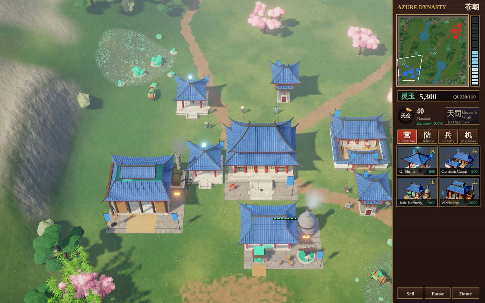
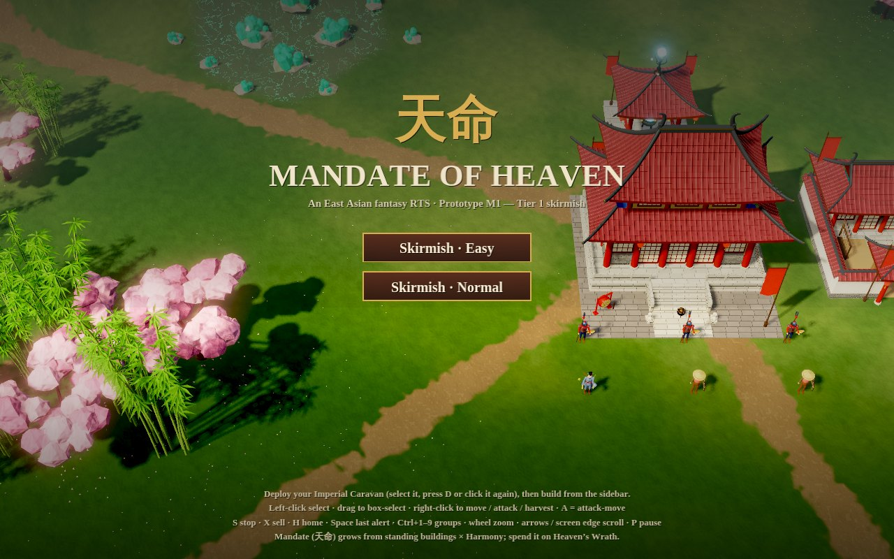
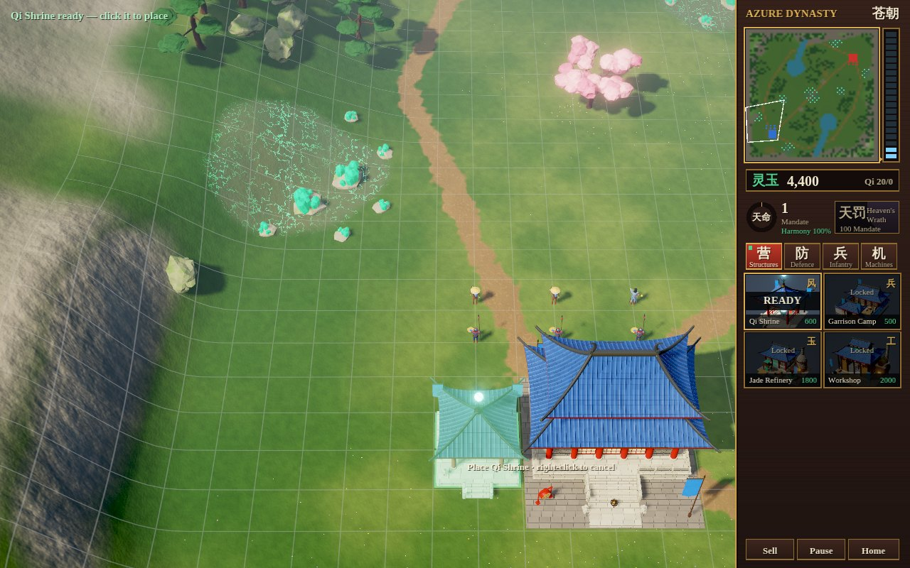
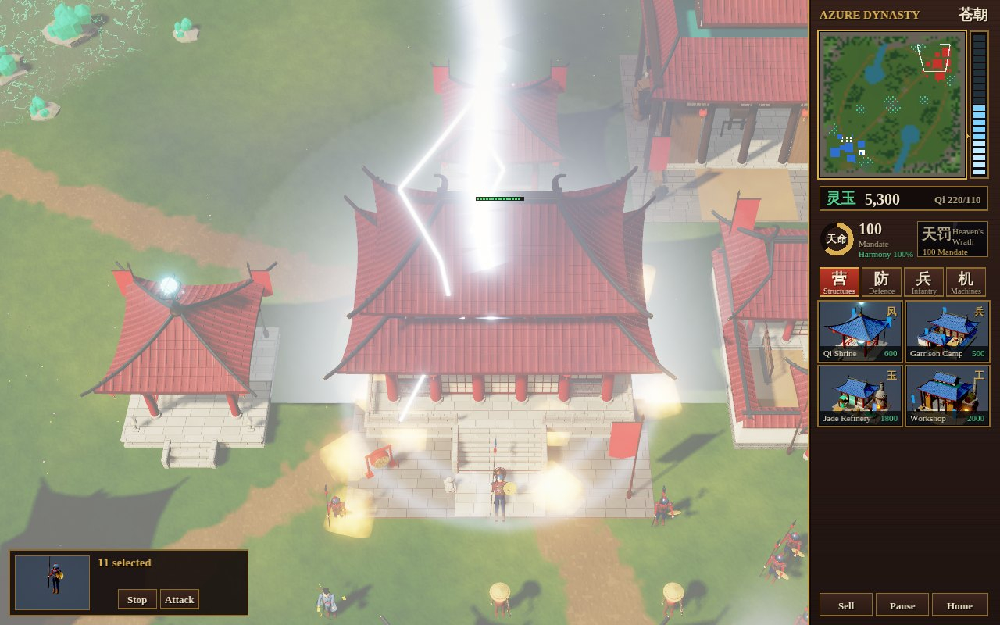
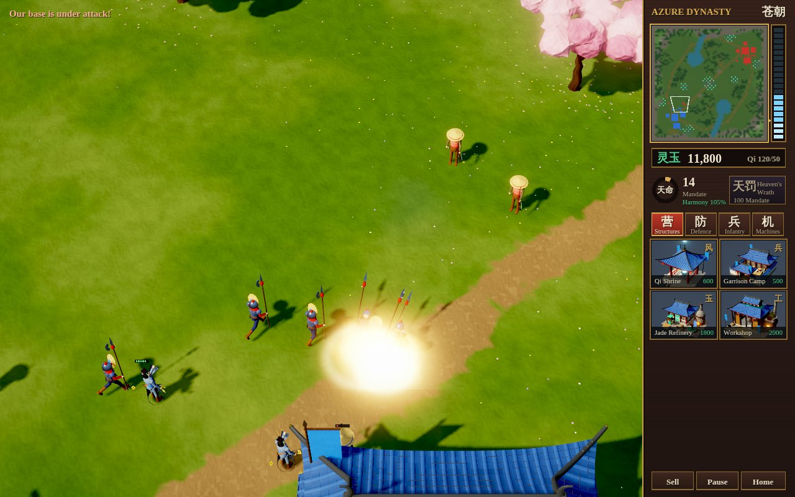
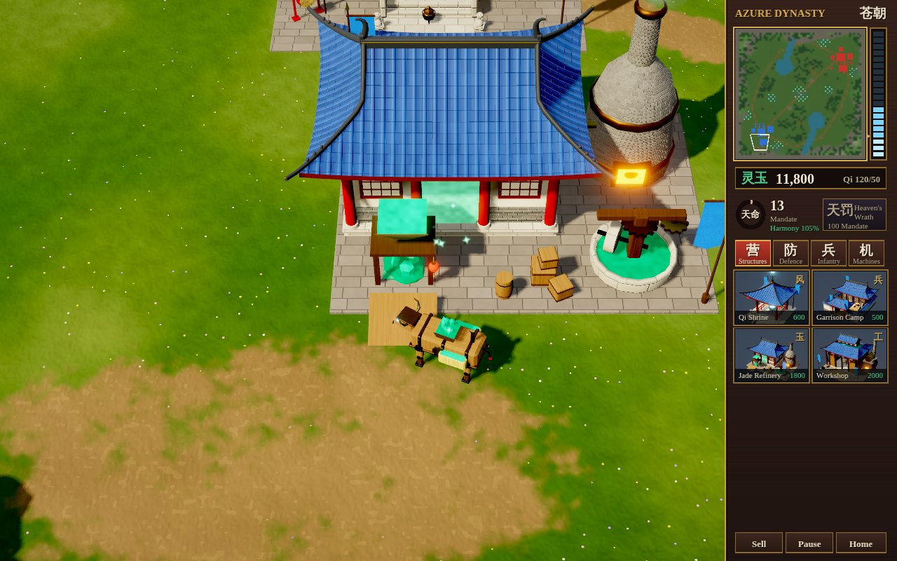
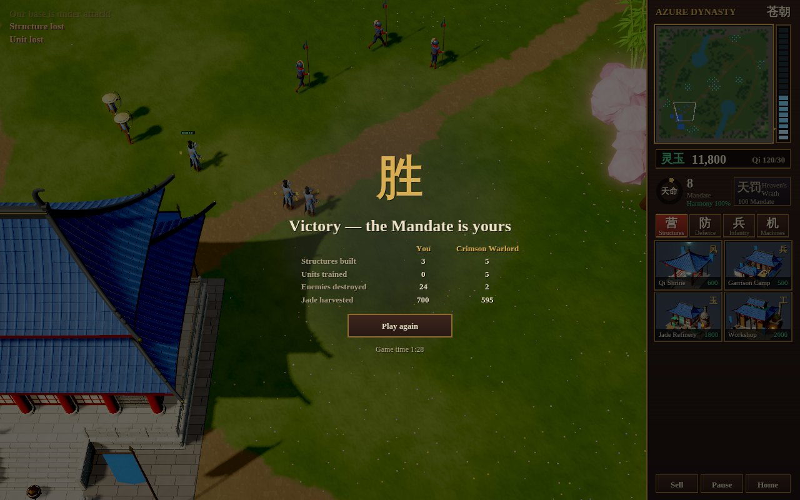

# Mandate of Heaven 天命 — East Asian fantasy RTS (prototype)

A Command & Conquer–style base-building RTS set in a mythic Three Kingdoms world: geomancers,
clockwork oxen, elemental academies and — at the end of the tech tree — magitech that mirrors
modern weapons. Visual target: *Red Alert 2, remastered*.

**Status: M1 — playable prototype.** One map (Peach Garden Valley), tier-1 Azure Dynasty,
skirmish against an AI (Easy / Normal). See [docs/GDD.md](docs/GDD.md) for the design and
[docs/ARCHITECTURE.md](docs/ARCHITECTURE.md) for the portability plan (WebGL2 now;
Metal / Vulkan / D3D11 and iOS / macOS / Windows / Linux later).



| | |
|---|---|
|  |  |
|  |  |
|  |  |

## Run
```bash
npm install
npm run dev          # generates assets, then http://localhost:5173 (game) and /viewer.html (asset viewer)
```

## How to play (M1)
1. **Deploy the Imperial Caravan** — select it and press **D** (or click it again). It unfolds
   into the **Governor's Yamen**, your construction yard.
2. **Build from the sidebar** — click a cameo to start building (clock-wipe progress). When a
   structure says **READY**, click it again and place it on the grid near your base (green =
   legal; the jade lines preview **Harmony** adjacencies). Right-click a cameo to cancel.
   Units go straight to the rally point (select a factory, right-click the ground to set it).
3. **Economy** — the **Jade Refinery** comes with a **Wooden Ox** that harvests Spirit Jade
   fields automatically. **Qi Shrines** supply Qi (the vertical bar); in low Qi, production runs
   at half speed and Arrow Towers go dark.
4. **Mandate 天命** accrues from your *standing* structures × Harmony. At 100 it pays for
   **Heaven's Wrath** — a lightning strike anywhere on the map (45 s recharge).
5. **Win** by destroying every enemy unit and structure (walls excepted). The AI builds a base, expands its
   harvesting and sends waves once it has an army — defend with towers and walls, then push.

| Input | Action |
|---|---|
| Left-click / drag | Select / box-select (double-click = all of that type on screen) |
| Right-click | Move · attack · harvest · set rally point (contextual cursor) |
| A, then click | Attack-move |
| S · X · D | Stop · sell mode · deploy |
| Ctrl+1–9 / 1–9 | Assign / recall control group |
| H · Space | Jump to base · jump to last alert |
| Wheel · arrows · screen edge · middle-drag | Zoom · scroll · scroll · pan |
| P | Pause |

URL parameters: `?start=easy|normal` skips the title screen, `&time=<s>` fast-forwards.

## Scripts
| Script | What it does |
|---|---|
| `npm run assets` | Build all procedural assets → `public/assets/models/*.glb` (+ baked AO) |
| `npm run dev` / `build` | Dev server (game + viewer) / production build (`dist/`) |
| `npm test` | Unit tests: mesh winding, fixed-point + sim determinism (state-hash replays), economy, combat, AI |
| `npm run shaders:validate` | Compile every shader to SPIR-V (the Vulkan/Metal/D3D11 path) |
| `npx tsx tools/screenshot.ts <dir> "<query>" name …` | Headless screenshots (`PAGE=viewer` for the viewer; `cameo=1` renders sidebar portraits) |
| `npx tsx tools/playtest.ts <dir>` / `playtest2.ts` | Scripted headless playtests that drive the real UI and capture screenshots |
| `python3 tools/pack-hosted.py <dir> [game\|viewer]` | Package `dist/` for text-only static hosts (models as base64) |

## Layout
```
content/            rules + faction data (tech tree, costs, stats) — platform-neutral JSON
docs/               GDD, architecture
src/core/           math, noise, material model (shared with tools)
src/sim/            deterministic integer simulation: world, pathfinding, economy, combat, skirmish AI
src/world/          terrain data + biome generator, skirmish map
src/assets/         glTF loader
src/render/         renderer, camera, terrain, animation, overlays, particles, engine-drawn UI
src/render/rhi/     render hardware interface + WebGL2 backend + shader translator
src/render/shaders/ GLSL 4.50 (Vulkan dialect) sources
src/platform/       platform interface + web implementation
src/game/           game client: camera, selection & orders, sidebar HUD, VFX
src/apps/game/      game entry (title screen, skirmish)
src/apps/viewer/    asset viewer / diorama
tools/assetgen/     procedural modelling kit, Chinese-roof generator, humanoid rig, recipes
```

## Not in M1 yet
Fog of war, sound, multiplayer netcode (the sim is lockstep-ready), garrisoning, drag-placed
walls, the Artificer / Gliding Horse / Jade Vault, tier 2+, more detailed humanoid models and
more building variety — see the milestones in the GDD.
